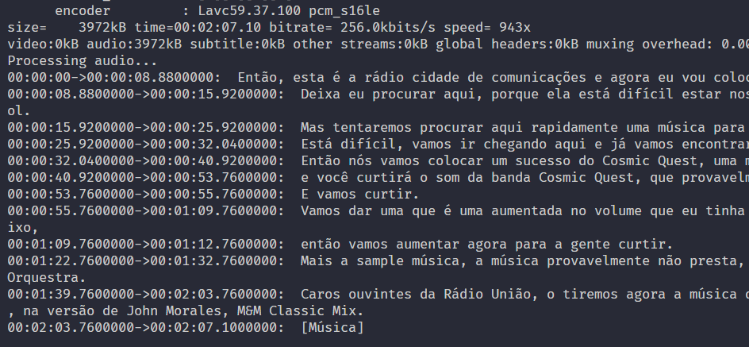

# WHISPER-TEST

Mini application made in C# to test Whisper.NET functionalities

## What's done:

- Checking the existence of the Model
- Downloading the Model
- Transcribing a WAV file

## What remains to be finished:

- Extract audio from a video file before transcription